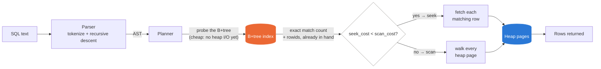
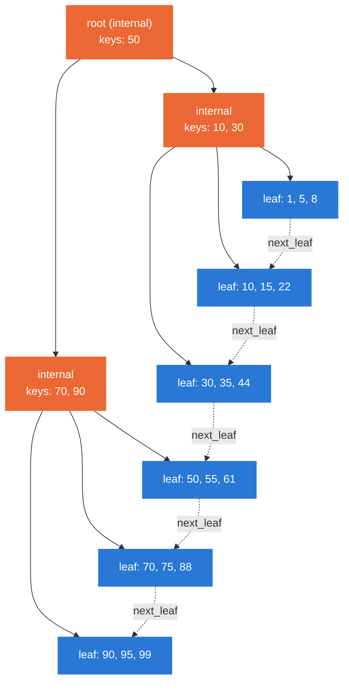
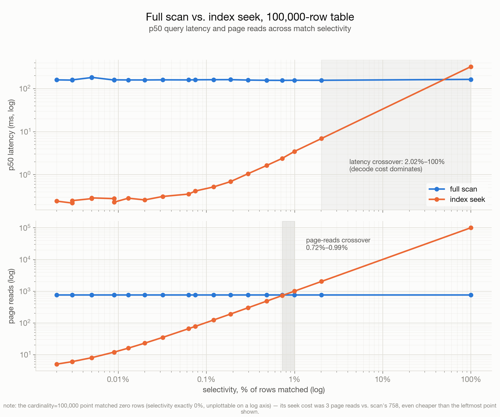

# SQL Query Engine: B-Tree Storage and Cost-Based Planner from Scratch

A minimal SQL query engine over a custom on-disk storage layer (package
name: `sqlengine`), built to answer one question with real numbers instead
of intuition: **at what selectivity does a full table scan beat an index
seek, and why?**

Single table. `SELECT col[, col...] FROM table [WHERE col OP literal]`.
`INTEGER` and `STRING` columns. No joins, no transactions, no concurrency,
no `UPDATE`/`DELETE`. Python stdlib only — no database libraries, not even
for the storage layer.

## How it works



The planner doesn't estimate cost, it *pays for a small piece of it up
front*: `BTree.search()` only ever touches B+tree pages, never the heap, so
probing the index to get an exact match count is cheap regardless of which
plan ultimately wins. If seek wins, its rowids are already sitting there —
no repeat work. If scan wins, the few B+tree pages read during that probe
are still counted honestly in the final page-read total. See
[Planner](#planner) below for the actual cost formula, and
[Findings](#findings) for what that formula produces at real scale.

## Architecture

Four components, each independently testable:

```
sqlengine/
  parser.py, ast.py        SQL text -> AST (tokenizer + recursive descent)
  storage/pager.py          raw 4KB page I/O over a single file (pread/pwrite/fsync)
  storage/page.py           page layouts: the meta page, and a slotted heap page
  btree.py                  on-disk B+tree secondary index: search, insert, splits
  table.py                  ties heap + btree together: insert(), scan(), get_row()
  planner.py                chooses scan vs. seek, executes, returns rows
  engine.py                 top-level handle: create_table / load_csv / execute
```

### Storage layer

Everything lives in one file, in fixed 4KB pages, allocated on demand from a
single monotonic counter — so heap and B+tree pages interleave in the file
in whatever order they were created, not grouped by type:

```
 page 0     page 1    page 2    page 3      page 4         page 5     ...
┌────────┬─────────┬─────────┬───────────┬─────────────┬─────────┐
│  META  │  HEAP    │  HEAP   │ BTREE leaf│ BTREE internal│  HEAP   │  ...
│        │ (rows)   │ (rows)  │           │               │ (rows)  │
└────────┴─────────┴─────────┴───────────┴─────────────┴─────────┘
   │           │________next________│                        │
   │                  (heap pages chain into a linked list)   │
   └── schema (JSON), heap_first/last, n_heap_pages, btree_root
       — everything the planner needs is an O(1) lookup here
```

Page 0 is the meta page: magic, page count, heap/B+tree root pointers, and
the table's schema as embedded JSON — this engine has exactly one table per
file, so there's no separate catalog. Table rows live in a **slotted heap
page**, the same technique SQLite and Postgres use to pack variable-length
rows into a fixed-size page — a slot directory grows forward from the
header while row bytes ("cells") pack backward from the end of the page:

```
 0                                                                    4095
┌───────────┬───────────────────┬─────────────────┬──────────────────┐
│ header 9B │ slot directory →  │   free space     │ ← packed cells   │
│ type,next,│ [off,len][off,len]│                  │  (row bytes,     │
│ n_slots,  │  ...grows toward··│                  │  grows toward··· │
│ cell_start│  the cells        │                  │  the directory)  │
└───────────┴───────────────────┴─────────────────┴──────────────────┘
```

Heap pages are chained into a singly linked list for full scans.

### B+tree index

One secondary index, on one column, mapping `value -> RowId(heap_page, slot)`:



*(a toy depth-2 tree — the dashed edges are `next_leaf`, threading every
leaf into one sorted chain regardless of tree shape; real leaves hold
150–270 entries each, see [Findings](#findings))*

Each node (leaf or internal) is serialized whole into one 4KB page; insert
writes the candidate node and only splits it if serialization overflows the
page. This means **fanout is not a constant** — it's "however many entries
fit in 4KB," which is why an INTEGER-keyed index has measurably higher
fanout than a STRING-keyed one (fixed 8-byte packed ints vs. variable-length
strings — see `--json-out` from `structure_stats.py`).

The one real bug worth calling out from building this: with a non-unique
indexed column, a run of duplicate keys can span more than one leaf page.
Descending with a plain `bisect_right` on the bare key value routes you to
wherever a *new* insert of that value would go — the rightmost matching
leaf — silently dropping every match to its left. The fix was to give every
entry (and every internal separator) a full `(value, page_id, slot)`
composite sort key, and have search descend using a low-sentinel probe
`(value, -1, -1)` that sorts before any real entry with that value,
guaranteeing the descent lands at-or-before the true leftmost match.
`tests/test_btree.py::test_duplicate_run_spans_multiple_leaves` pins this
down (5,000 rows sharing one key; a fresh checkout that reverts the fix
fails it immediately).

### Planner

An index seek is only ever *possible* for an equality predicate on the
indexed column — the B+tree can't serve anything else. Among the plans that
are possible, the choice is **cost-based**, computed fresh per query:

```
scan_cost = n_heap_pages                    # every heap page, once, sequentially
seek_cost = btree.depth() + len(matches)    # tree descent + one heap fetch per match (worst case)
```

Both terms are O(1) to look up, not estimates recomputed by walking
anything: `n_heap_pages` is a counter on the Table, incremented only when a
new heap page is allocated and persisted in the meta page; `btree.depth()`
is likewise a counter on the BTree, incremented only when a root split
happens (the one thing that can change it), instead of a fresh
root-to-leaf descent on every query. The trick that makes `seek_cost`
cheap to get *exactly*, not just estimate: `BTree.search()` only ever
touches B+tree pages, never the heap — so getting the real match count and
comparing it against `scan_cost` costs nothing beyond what executing the
seek would have paid anyway. If seek wins, its rowids are already in hand;
if scan wins, the B+tree pages read while costing it are still counted in
`ExecutionStats.page_reads`, because that I/O genuinely happened. One
consequence of both terms being exact rather than estimated: the REPL's
`[method] N page reads, cost model: scan=X seek=Y` line isn't just a log
message, it's checkable — for a chosen seek, `N` always equals `Y` exactly
(try it: `python3 -m sqlengine`, `SELECT * FROM t WHERE id = 42`).

This is why an index on the WHERE column is *not* sufficient for a seek to
be chosen — see `tests/test_engine.py::test_small_table_prefers_scan_even_with_index`
(one heap page beats any seek) and `::test_high_selectivity_prefers_scan_despite_index`
(matching nearly every row makes the seek's O(matches) heap fetches cost
more than one sequential scan). `tools/bench.py`'s `force_method` bypasses
this decision entirely — it exists to measure the *raw* cost curves the
model relies on, and to double-check the automatic choice against the
alternative it didn't pick.

### Durability

No WAL, no transactions — but `insert()` still makes a concrete promise:
once it returns, the row is durable. Every insert ends with exactly one
`fsync()` after all pages it touched (heap page(s), any B+tree split pages,
the meta page) have been written. A single `pwrite()` of a page-aligned,
page-sized buffer is atomic in practice on local filesystems, so a crash
can only ever lose whichever page(s) hadn't been fsync'd yet — it can't
tear a page mid-write. `tools/correctness.py`'s crash-recovery test forks a
worker that inserts rows one at a time and reports "committed" only after
each `insert()` call returns, `SIGKILL`s it at a random point, and verifies
every reported-committed row survives a fresh reopen.

## Setup

```bash
python3 -m pip install -e ".[dev]"   # installs pytest; the engine itself has zero dependencies
```

## Running things

```bash
# Try it: drops into a REPL, auto-creating a 2,000-row demo table (indexed
# on `id`) the first time you run it. Prints which plan the cost-based
# planner picked and why for every query.
python3 -m sqlengine
sqlengine> SELECT * FROM t WHERE id = 42
...
[seek] 3 page reads, cost model: scan=15 seek=3
sqlengine> .stats
sqlengine> .help

# Unit tests (parser, pager/heap page, B+tree, end-to-end engine)
python3 -m pytest -q

# Correctness oracle: load the same synthetic CSV into sqlengine and SQLite,
# fire randomized queries at both, diff result sets; also runs the crash
# recovery test.
python3 tools/correctness.py --rows 5000 --cardinality 50 --queries 300

# Performance: page reads & latency (scan vs seek) across sizes, the
# crossover selectivity sweep, and insert throughput with/without an index.
python3 tools/bench.py --sizes 1000 10000 100000 1000000 --crossover-rows 100000

# Structure: B+tree depth/fanout/splits/index-size as a function of row
# count, and a fanout comparison between an INTEGER key and a STRING key.
python3 tools/structure_stats.py --checkpoints 1000 10000 100000

# Generate a standalone synthetic dataset (controlled cardinality/order):
python3 tools/gen_data.py --rows 100000 --cardinality 500 --order random -o data.csv
```

## Findings

_Numbers below are from actual runs on the development machine (seed 0) —
`python3 tools/bench.py --sizes 1000 10000 100000 1000000 --cardinality 500
--crossover-rows 100000 --insert-rows 200000` and
`python3 tools/structure_stats.py --checkpoints 1000 10000 100000 500000
--cardinality 2000 --fanout-rows 100000`. Treat them as illustrative of the
shape of the result on this machine's disk/CPU, not portable performance
claims._

### The crossover selectivity — the interesting number

There are two different crossover points here, and the gap between them is
itself the finding. Sweeping selectivity at a fixed 100,000-row table:



*(generated by `docs/make_crossover_chart.py` from `bench_report.json` —
regenerate with `python3 tools/bench.py --crossover-rows 100000 --json-out bench_report.json && python3 docs/make_crossover_chart.py`)*

A few exact points from that sweep:

| selectivity | scan reads | seek reads | scan p50 | seek p50 |
|---|---|---|---|---|
| 0.005% (1 match) | 758 | 3 | 158.1ms | 0.23ms |
| 0.32% | 758 | 35 | 160.5ms | 0.31ms |
| 0.72% | 758 | 731 | 156.1ms | 2.39ms |
| 0.99% | 758 | 1,002 | 156.9ms | 3.46ms |
| 2.02% | 758 | 2,035 | 156.8ms | 6.93ms |
| 100% (all match) | 758 | 100,737 | 164.5ms | 326.3ms |

**Page-reads crossover: between 0.72% and 0.99% selectivity.** This is the
"real" one — the pure I/O signal, and it lands almost exactly where the
back-of-envelope math says it should: a full scan always touches the same
758 heap pages no matter what; a seek touches roughly one heap page per
match, so the two cross when `matches ≈ n_heap_pages`, i.e. selectivity ≈
`1 / (rows_per_page)` ≈ `758 / 100,000` ≈ **0.76%**. That's the textbook
reason cost-based planners exist: below ~1% match rate, an index pays for
itself; above it, you're better off reading the table straight through.

**Latency crossover: between 2.02% and 100%.** Much later than the I/O
crossover, because in a pure-Python engine, wall-clock time is dominated by
per-row decode cost (`struct.unpack` + string decode), paid once per row
*examined*. A scan pays that cost for all 100,000 rows regardless of
selectivity (~157ms flat); a seek only pays it per *match*, so seek stays
latency-cheaper long after it's stopped being I/O-cheaper. This is exactly
what `sqlengine/planner.py`'s cost model is built on: it compares
`n_heap_pages` against `depth + len(matches)` — the I/O-cost model, not the
latency one — which is why it starts preferring scan right around the true
~0.8% crossover rather than waiting until 2%+.

### Page reads and latency, scan vs. seek, by table size

| rows | scan reads | scan p50 | seek reads | seek p50 |
|---|---|---|---|---|
| 1,000 | 8 | 1.67ms | 6 | 0.15ms |
| 10,000 | 74 | 16.57ms | 29 | 0.24ms |
| 100,000 | 758 | 164.37ms | 191 | 0.70ms |
| 1,000,000 | 7,817 | 1,653.9ms | 2,004 | 6.77ms |

At 1,000,000 rows (cardinality 500, ~2,000 matches, ~0.2% selectivity): the
seek touches **~3.9x fewer pages** (2,004 vs 7,817) but is **~244x lower
latency** (6.77ms vs 1,653.9ms) — the same decode-cost effect as above, just
more dramatic at scale, since the scan's 1M-row decode cost dwarfs its
already-larger page-read cost.

### B+tree structure vs. row count

Indexed on `value` (cardinality 2,000, random insert order):

| rows | depth | leaf fanout (mean) | internal fanout (mean) | splits / 10K inserts | index pages | table pages | index / total |
|---|---|---|---|---|---|---|---|
| 1,000 | 2 | 250.0 | 4.0 | 30.0 | 5 | 8 | 38.5% |
| 10,000 | 2 | 158.7 | 63.0 | 65.6 | 64 | 79 | 44.8% |
| 100,000 | 3 | 194.9 | 103.4 | 50.3 | 518 | 782 | 39.9% |
| 500,000 | 3 | 206.9 | 143.1 | 47.9 | 2,434 | 3,906 | 38.4% |

Depth jumps from 2 to 3 between 10K and 100K rows — leaf fanout ~150-250
means a depth-2 tree tops out around 150² ≈ 22,500-62,500 keys, consistent
with the jump landing in that range. The index consistently costs a bit
more disk space than the table itself is worth in page count (~40% of total
pages) — each leaf entry carries the full `(key, RowId)` plus internal
separators now carry a `(key, RowId)` tiebreaker too (see the duplicate-key
fix above), so the index isn't a lightweight structure here.

**Fanout by key type, 100,000 rows:** INTEGER (`id`, fixed 8-byte packed) —
mean leaf fanout 194.2 (range 137-272); STRING (`label`, variable-length,
`"row_<id>"`) — mean leaf fanout 170.4 (range 114-228). Confirms the claim
in `btree.py`'s docstring: wider keys mean fewer entries fit in 4KB, so
fanout drops — here by about 12%, for a string that's only a few bytes
wider than the packed int.

### Insert throughput, with and without an index

200,000 rows: **2,091.6 rows/sec** with the index vs **16,872.5 rows/sec**
without — indexing costs roughly **8x** insert throughput. `fsync()` count
is identical either way (one per row, the durability boundary described
above), so the gap is B+tree descent + node serialization work, not I/O.

### Correctness

- **SQLite agreement**: 100.0000% (zero mismatches) across every oracle run,
  up to **10,000 randomized queries** on a 50,000-row table (cardinality
  200; the planner split those 10,000 queries 9,435 scan / 565 seek on its
  own, cost-based) — plus smaller runs at cardinality 5 (heavy duplication)
  and 30.
- **B+tree invariants**: hold after bulk load at every size tested above,
  *and* after every single insert in a dedicated 1,500-insert stress test
  with heavy duplication (`tests/test_btree.py::test_invariants_hold_after_every_single_insert`) — sorted keys, equal leaf depth, correct separator/child counts, re-checked from scratch after each insert.
- **Crash recovery**: `kill -9` mid-insert (worker process, random kill
  point) followed by a fresh reopen, run across 6+ seeds and table sizes up
  to 20,000 rows — every row reported as committed (i.e. its `insert()`
  call, and thus its `fsync()`, had returned) survived every time.

## Design limitations (by scope, not oversight)

- Single table per file; no catalog, no `CREATE TABLE` DDL beyond
  `Engine.create_table()`.
- One index, on one column, equality lookups only. Range predicates never
  use the index even though the B+tree's leaf-linked-list would support
  range scans trivially — that's future scope, not a limitation of the data
  structure.
- No `NULL`, no `UPDATE`/`DELETE`, no multi-column keys.
- No WAL, no transactions, no concurrent access (single writer, single
  process, by construction — the file isn't locked against concurrent
  opens).
- The cost model is a page-count heuristic (`n_heap_pages` vs.
  `depth + matches`), not a full statistics-based optimizer — no
  histograms, no cached selectivity estimates across queries, no join
  ordering (there are no joins). It's exact for I/O cost on this engine's
  own page format, not a general-purpose cost estimator.
